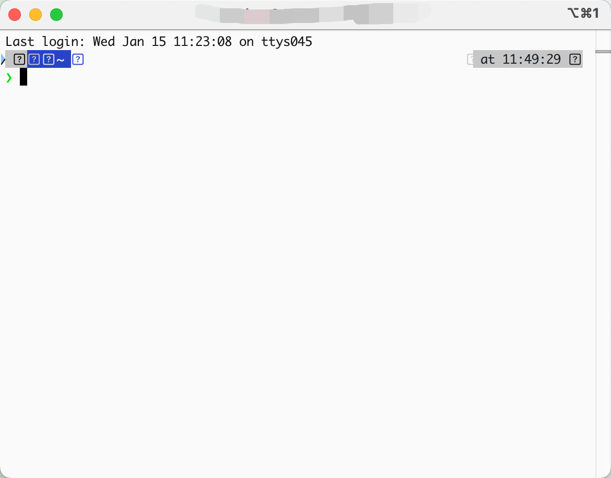
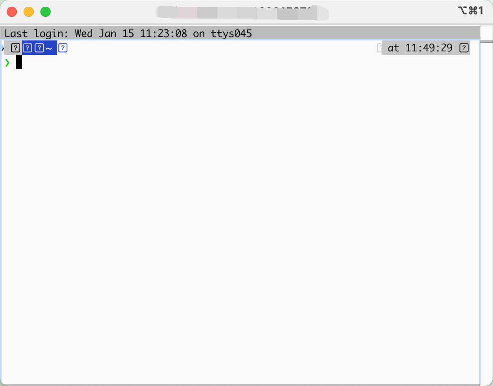
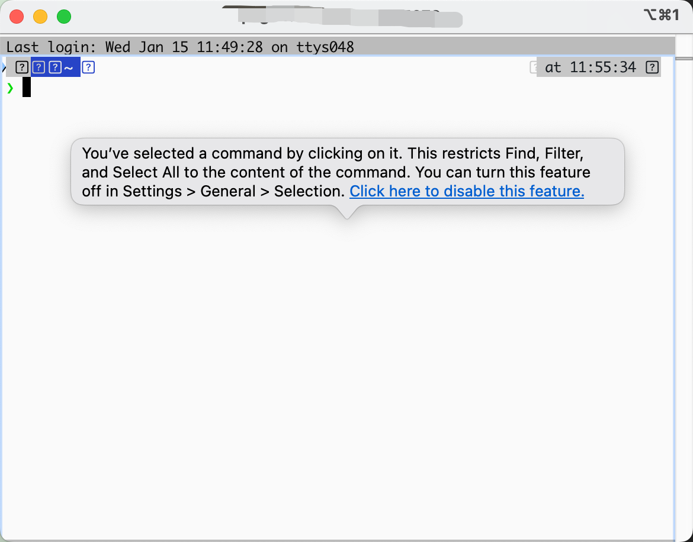
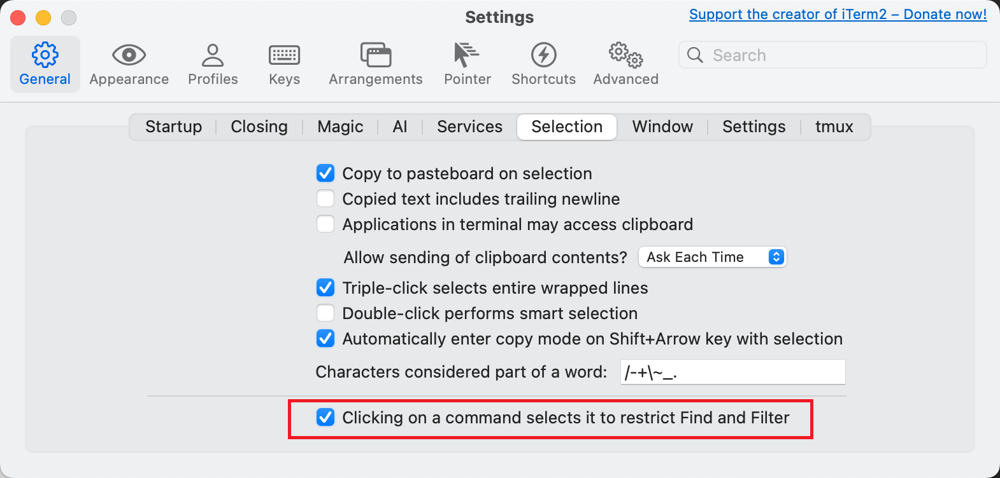

近期不知道是怎么回事，
iTerm鼠标点一下就会出现一个外框，再点一下就消失了，非常讨厌，猜测了多种可能的原因：ohmyzsh、power10k，换到最基础的bash配置还是存在，基本上就确定是iTerm的问题了，但找不到是哪里配置的这个，索性就用appcleaner卸载，把所有配置文件也都删了，然后用homebrew重新安装，结果一打开就发现了问题所在。

不点击时这样

点击一下就变成这样

当然这不是我平时使用的状态，只是说明一下这个难受的状态。

在复现这个问题的过程中又发现了一个新问题，因为开始我是用appcleaner卸载的，打开后第一时间iTerm就提示了那个让我难受的功能，还提示要不要关掉，然后我去看了下，但当我要复现这个过程，使用homebrew把它卸载了之后却没有这个弹窗了，充分说明用homebrew是卸载不干净的。

用appcleaner卸载，又重新安装之后终于复现了

点击那个链接就跳到这个配置页

仔细看这个功能是为了让搜索高亮字符串的时候限制在选定的区域，看起来是个非常有用的功能，但这个展示方式真是太annoying了。
