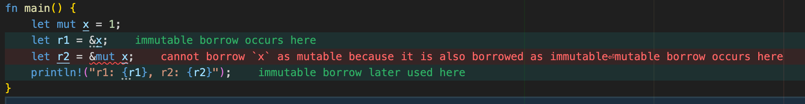

Rust以高性能和内存安全性著称，高性能的一个很重要的特性就是**无畏并发**，本文就来从最基础的概念开始来讲讲Rust的并发编程。

## 什么是并发？

并发可以认为是比*并行*更广义的一个概念，通常我们说并发的时候指的是程序在同一段时间内执行，而不去关注这些人物是否在同一个核心上，而并行更强调在多核上同时运行不同的任务。

本文我们不过分关注并发和并行的区别，而更关注**并发安全**的问题。

## Rust的语言特性

### 所有权系统规则

Rust的所有权系统有这样一条规则：


1. 要么有一个可变引用 &mut  T<br>
2. 要么有多个不可变引用 &T<br>
3. 两者不能同时存在




这里要注意，如果上面的代码没有最后一行println!，就不会报错，这是由于NLL(Non-Lexical Lifetime)优化。

NLL的作用：

1. 如果不可便引用`r1`在后续代码中不再被使用，Rust编译器会自动缩短`r1`的生命周期
2. 即如果把上面代码的最后一行删除，则在创建`r2`前，`r1`的借用就已经结束了，并不满足同时存在可变引用和不可变引用的规则

### 思考：为什么要这样设计？

1. 实践友好性：允许更灵活地组织代码，可以根据变量的实际使用情况而不只是定义的情况来决定规则的适用性
2. 安全性保障：只要存在实际的数据经正可能，编译器一定会报错
3. 零成本抽象：生命周期分析在编译时完成，不影响运行时性能


### 借用和引用

前面我们混淆了借用和引用的概念，下面来详细区分一下。

#### 引用（Reference）

- 定义：引用是指向某个指的指针，允许访问数据但不拥有它的所有权。
- 类型：
  - 不可变引用`&T`：允许读取数据，但不能修改
  - 可变引用`&mut T`：允许读取和修改数据

所以上面的例子就是引用。

#### 借用（Borrowing）

- 定义：通过引用访问数据的行为称为借用
- 规则：
  - 借用规则（核心安全准则）
    1. 同一时刻，要么只有一个可变引用，要么只能有多个不可变引用
    2. 引用必须始终有效（不能悬垂）
- 本质：借用是Rust的内存安全保障机制，确保在编译器消除数据竞争和悬垂指针

| 概念 | 角色               | 关键点                                               |
| ---- | ------------------ | ---------------------------------------------------- |
| 引用 | 具体指针           | 分为 `&T` 和 `&mut T`，是内存地址的抽象表示          |
| 借用 | 使用引用的行为规则 | 通过编译器的静态检查，确保引用的使用符合内存安全规则 |

所以我们常说的是`Borrow Checker`，而不是`Reference Checker`。借用是规则本身，而引用是内存地址的抽象表示。

#### 实际场景中的借用模式

1. 分离作用域

```rust
let mut x = 1;
{
    let r1 = &x; // 不可变借用开始
    println!("{}", r1);
}
let r2 = &mut x; // 
```

2. 函数参数中的借用

```rust
fn process(s: &mut String) { /*...*/ }

let mut data = String::from("hello");
process(&mut data);  // 可变借用发生在此处
println!("{}", data); // ✅ 借用已结束
```

### 